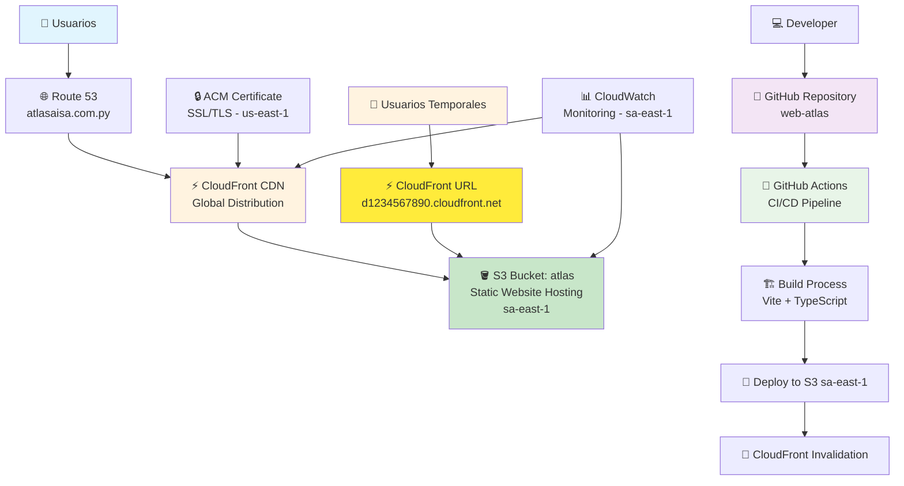
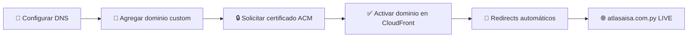
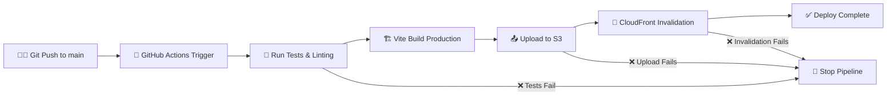

# 🚀 AWS Deployment Architecture - ATLAS Agro Industrial

## 📋 Información General

| Campo | Valor |
|-------|-------|
| **Proyecto** | ATLAS Agro Industrial - Website Corporativo |
| **Tipo** | Single Page Application (SPA) |
| **Estrategia** | Desarrollo → Producción (Sin Staging) |
| **Dominio** | atlasaisa.com.py (configuración pendiente) |
| **URL Temporal** | CloudFront Distribution URL |
| **Región AWS** | sa-east-1 (São Paulo, Brasil) |
| **CI/CD** | GitHub Actions |
| **IaC** | Terraform |
| **Repositorio** | https://github.com/HCo-Innova/web-atlas.git |
| **Fecha Creación** | 13 de septiembre de 2025 |

---

## 🏗️ Arquitectura de Producción

### **Diagrama de Arquitectura**



### **Componentes Principales**

| Componente | Servicio AWS | Propósito | Configuración |
|------------|--------------|-----------|---------------|
| **DNS** | Route 53 | Resolución de dominios | `atlasaisa.com.py` + `www.atlasaisa.com.py` |
| **CDN** | CloudFront | Distribución global + SSL | Cache optimizado para SPA |
| **Storage** | S3 | Hosting de archivos estáticos | Bucket `atlas` en sa-east-1 |
| **SSL** | ACM | Certificados gratuitos | Wildcard `*.atlasaisa.com.py` (us-east-1) |
| **Monitoring** | CloudWatch | Logs y métricas | Alertas automáticas (sa-east-1) |
| **Temporal** | CloudFront URL | Acceso directo sin dominio | `d1234567890.cloudfront.net` |

---

## � Estrategia de Dominio: Temporal → Definitiva

### **🚀 Fase 1: Deployment Temporal (Inmediato)**

#### **URL de Acceso Temporal**
```
https://d1234567890.cloudfront.net
```
- **Disponible**: Inmediatamente después del deployment
- **SSL**: Certificado CloudFront incluido
- **Performance**: CDN global completo
- **Funcionalidad**: 100% igual al sitio final

#### **Configuración Temporal**
- **S3 Bucket**: `atlas` (sa-east-1)
- **CloudFront**: Sin dominio custom
- **SSL**: Certificado por defecto de AWS
- **Testing**: URL funcional para validaciones

### **🎯 Fase 2: Migración a Dominio Definitivo**

#### **Cuando `atlasaisa.com.py` esté configurado:**



#### **Pasos de Migración:**
1. **DNS Configuration**: Apuntar `atlasaisa.com.py` a CloudFront
2. **SSL Certificate**: Solicitar certificado ACM para `*.atlasaisa.com.py`
3. **CloudFront Update**: Agregar dominio custom a distribución existente
4. **Testing**: Validar que ambas URLs funcionen
5. **Redirects**: Configurar redirects de URL temporal a definitiva

#### **Zero Downtime**: 
- ✅ **URL temporal sigue funcionando** durante la migración
- ✅ **Contenido idéntico** en ambas URLs
- ✅ **Migración gradual** sin interrupciones

### **🔧 Consideraciones Técnicas**

#### **Limitaciones de URL Temporal**
- ❌ **SEO**: No indexable por buscadores
- ❌ **Branding**: URL genérica de AWS
- ❌ **Memorabilidad**: Difícil de recordar/compartir
- ✅ **Funcionalidad**: Idéntica al sitio final

#### **Beneficios de la Estrategia**
- ✅ **Testing inmediato**: Validar todo antes del dominio
- ✅ **Desarrollo continuo**: No esperar configuración DNS
- ✅ **Migración suave**: Sin reconstruir infraestructura
- ✅ **Backup URL**: URL temporal como respaldo

---

## �🎯 Decisiones de Arquitectura

### **✅ Decisiones Adoptadas**

#### **1. Sin Entorno de Staging**
- **Razón**: SPA pequeña y simple
- **Beneficio**: Menor complejidad y costos
- **Mitigación**: Testing exhaustivo en desarrollo local + PR reviews

#### **2. Región São Paulo (sa-east-1)**
- **Razón**: Proximidad geográfica con Paraguay
- **Beneficio**: Menor latencia para usuarios locales
- **Consideración**: CloudFront distribuye globalmente desde esta base

#### **3. Estrategia Temporal → Definitiva**
- **Razón**: Dominio `atlasaisa.com.py` pendiente de configuración
- **Beneficio**: Development y testing sin esperas
- **Migración**: Sin downtime cuando dominio esté listo

#### **4. Deploy Directo a Producción**
- **Trigger**: Push a rama `main`
- **Validación**: GitHub Actions con tests automáticos
- **Rollback**: Git revert + re-deploy automático

#### **5. Terraform para IaC**
- **Trigger**: Push a rama `main`
- **Validación**: GitHub Actions con tests automáticos
- **Rollback**: Git revert + re-deploy automático

#### **3. Terraform para IaC**
- **Estructura**: Módulos reutilizables
- **Estado**: S3 backend con DynamoDB locking
- **Versionado**: Git tags para releases de infraestructura

#### **6. GitHub Actions para CI/CD**
- **Workflow**: Single pipeline para producción
- **Security**: AWS credentials via GitHub Secrets
- **Notificaciones**: Slack/Discord para deploys exitosos/fallidos

### **❌ Decisiones Rechazadas**

| Opción Rechazada | Razón del Rechazo |
|------------------|-------------------|
| **Multi-environment (dev/staging/prod)** | Overhead innecesario para SPA simple |
| **Kubernetes/ECS** | Over-engineering para archivos estáticos |
| **AWS Amplify** | Menor control sobre configuración |
| **Serverless Framework** | Terraform es más flexible |

---

## 🛠️ Stack Tecnológico Completo

### **Frontend**
- **Framework**: React 19.1.0 + TypeScript 5.5.4
- **Build Tool**: Vite 6.3.5
- **Styling**: Tailwind CSS 3.4.4
- **State Management**: Redux Toolkit 2.2.1

### **Infrastructure as Code**
- **Terraform**: >= 1.5.0
- **AWS Provider**: >= 5.0.0
- **Backend**: S3 + DynamoDB

### **CI/CD**
- **GitHub Actions**: Workflows YAML
- **AWS CLI**: Para deployments
- **Node.js**: >= 18.x para builds

---

## 🌍 Configuración de Dominios

### **Estructura de Dominios**

| Dominio | Propósito | Configuración |
|---------|-----------|---------------|
| `atlasaisa.com.py` | Dominio principal | A record → CloudFront |
| `www.atlasaisa.com.py` | Alias del principal | CNAME → atlasaisa.com.py |
| `d1234567890.cloudfront.net` | **URL Temporal** | **Acceso directo sin dominio** |

### **Certificados SSL**
- **Temporal**: Certificado CloudFront por defecto (automático)
- **Definitivo**: Wildcard certificate (`*.atlasaisa.com.py`)
- **Validación**: DNS validation via Route 53
- **Renovación**: Automática por AWS ACM
- **Protocolo**: TLS 1.2+ minimum

**⚠️ Nota**: Los certificados ACM para CloudFront deben crearse en `us-east-1`, aunque el bucket esté en `sa-east-1`.

---

## 📊 Configuración de CloudFront

### **Comportamientos de Cache**

| Path Pattern | Cache Behavior | TTL |
|--------------|----------------|-----|
| `/` | Default | 24h |
| `/static/*` | Cache agresivo | 1 año |
| `/assets/*` | Cache agresivo | 1 año |
| `*.js, *.css` | Cache con versioning | 1 año |
| `*.html` | Cache mínimo | 5 min |

### **Configuraciones Especiales**
- **SPA Routing**: Error 404 → redirect a `/index.html`
- **Compresión**: Gzip + Brotli automático
- **Security Headers**: CSP, HSTS, X-Frame-Options
- **CORS**: Configurado para assets

---

## 🔒 Configuración de Seguridad

### **S3 Bucket Security**
```json
{
  "PublicReadAccess": true,
  "PublicWriteAccess": false,
  "BlockPublicAcls": false,
  "IgnorePublicAcls": false,
  "BlockPublicPolicy": false,
  "RestrictPublicBuckets": false
}
```

### **CloudFront Security Headers**
```yaml
Strict-Transport-Security: "max-age=31536000; includeSubDomains"
X-Content-Type-Options: "nosniff"
X-Frame-Options: "SAMEORIGIN"
X-XSS-Protection: "1; mode=block"
Referrer-Policy: "strict-origin-when-cross-origin"
```

### **IAM Roles y Políticas**
- **GitHub Actions Role**: Mínimos permisos necesarios
- **S3 Access**: Solo escritura en bucket específico
- **CloudFront**: Solo invalidación de distribución

---

## 🚀 Pipeline de CI/CD

### **Flujo de Deployment**



### **Triggers de Deployment**
- **Automático**: Push a rama `main`
- **Manual**: Workflow dispatch desde GitHub UI
- **Rollback**: Git revert + re-trigger

### **Validaciones Pre-Deploy**
1. **Linting**: ESLint + Prettier
2. **Type Checking**: TypeScript strict mode
3. **Tests**: Unit tests con Vitest
4. **Build Success**: Vite build sin errores
5. **Bundle Size**: Check de tamaño < 2MB

---

## 💰 Estimación de Costos

### **Costos Mensuales Estimados**

| Servicio | Tráfico Bajo | Tráfico Medio | Tráfico Alto |
|----------|--------------|---------------|--------------|
| **S3 Storage** | $0.50 | $1.00 | $2.00 |
| **S3 Requests** | $0.50 | $2.00 | $5.00 |
| **CloudFront** | $3.00 | $10.00 | $25.00 |
| **Route 53** | $0.50 | $0.50 | $0.50 |
| **ACM** | GRATIS | GRATIS | GRATIS |
| **Total** | **$4.50** | **$13.50** | **$32.50** |

### **Métricas de Tráfico**

| Categoría | Requests/mes | Data Transfer | Visitors/mes |
|-----------|--------------|---------------|--------------|
| **Bajo** | 100K | 10 GB | 1K |
| **Medio** | 1M | 100 GB | 10K |
| **Alto** | 10M | 1 TB | 100K |

---

## 📈 Monitoreo y Alertas

### **Métricas Clave**
- **Uptime**: > 99.9%
- **Response Time**: < 2s (95th percentile)
- **Error Rate**: < 1%
- **Cache Hit Ratio**: > 85%

### **Alertas Configuradas**
1. **Downtime**: > 5 minutos
2. **High Error Rate**: > 5% en 10 minutos
3. **Slow Response**: > 5s promedio en 15 minutos
4. **SSL Certificate**: Expira en 30 días

### **Dashboards**
- **CloudWatch**: Métricas de infraestructura
- **GitHub**: Status de deployments
- **Custom**: Dashboard unificado (opcional)

---

## 🔄 Procedimientos Operacionales

### **Deployment Normal**
```bash
# 1. Developer workflow
git add .
git commit -m "feat: nueva funcionalidad"
git push origin main

# 2. GitHub Actions se ejecuta automáticamente
# 3. Verificar deployment en CloudWatch logs
# 4. Validar sitio en producción
```

### **Rollback de Emergencia**
```bash
# 1. Identificar último commit bueno
git log --oneline

# 2. Revertir a commit específico
git revert <commit-hash>
git push origin main

# 3. GitHub Actions re-deploya automáticamente
```

### **Invalidación Manual de Cache**
```bash
# Si es necesario limpiar cache manualmente
aws cloudfront create-invalidation \
  --distribution-id <DISTRIBUTION_ID> \
  --paths "/*"
```

---

## 📁 Estructura de Archivos del Proyecto

### **📁 Estructura de Archivos del Proyecto**

```
├── .github/
│   └── workflows/
│       └── deploy-production.yml    # CI/CD pipeline principal
├── terraform/
│   ├── main.tf                      # Configuración principal
│   ├── variables.tf                 # Variables de Terraform
│   ├── outputs.tf                   # Outputs de infraestructura
│   ├── backend.tf                   # State backend S3
│   ├── providers.tf                 # AWS provider sa-east-1
│   └── modules/
│       ├── s3-website/             # Módulo S3 (bucket: atlas)
│       ├── cloudfront/             # Módulo CloudFront
│       ├── route53/                # Módulo Route 53 (atlasaisa.com.py)
│       └── acm/                    # Módulo ACM (us-east-1)
├── scripts/
│   ├── deploy.sh                   # Script deployment local
│   ├── invalidate-cache.sh         # Script invalidación
│   ├── setup-aws.sh               # Setup inicial AWS
│   └── migrate-domain.sh           # Script migración temporal→definitiva
└── docs/
    ├── AWS_DEPLOYMENT_ARCHITECTURE.md  # Este documento
    ├── DEPLOYMENT_GUIDE.md             # Guía de deployment
    └── DOMAIN_MIGRATION_GUIDE.md       # Guía migración de dominio
```

---

## 🎯 Próximos Pasos

### **Fase 1: Setup Temporal** ⏳
- [ ] Crear archivos Terraform (región sa-east-1)
- [ ] Configurar GitHub Secrets para AWS
- [ ] Setup del state backend
- [ ] Provisionar infraestructura temporal
- [ ] **Obtener URL CloudFront funcional**

### **Fase 2: CI/CD Pipeline** ⏳
- [ ] Crear workflow de GitHub Actions
- [ ] Configurar permisos IAM para sa-east-1
- [ ] Testing del pipeline completo
- [ ] Validación de URL temporal

### **Fase 3: Preparación para Dominio Definitivo** ⏳
- [ ] Configurar módulo ACM en us-east-1
- [ ] Preparar configuración Route 53
- [ ] Crear scripts de migración
- [ ] Documentar proceso de migración

### **Fase 4: Migración a Dominio Definitivo** ⏳
- [ ] Configurar DNS de atlasaisa.com.py
- [ ] Solicitar certificado SSL definitivo
- [ ] Actualizar CloudFront con dominio custom
- [ ] Testing de dominio definitivo
- [ ] Configurar redirects y limpieza

---

## 📞 Información de Contacto y Soporte

### **Responsables**
- **Tech Lead**: [Nombre]
- **DevOps**: [Nombre]
- **Product Owner**: [Nombre]

### **Recursos Útiles**
- **Repositorio**: https://github.com/HCo-Innova/web-atlas.git
- **AWS Console**: https://sa-east-1.console.aws.amazon.com/
- **S3 Bucket**: `atlas` (sa-east-1)
- **CloudFront Distribution**: [URL cuando esté creada]
- **URL Temporal**: [CloudFront URL cuando esté disponible]
- **Dominio Definitivo**: `atlasaisa.com.py` (pendiente configuración)
- **Monitoring Dashboard**: [URL cuando esté creado]

---

**Documento vivo - Última actualización: 13 de septiembre de 2025**

---

> 💡 **Nota**: Este documento se actualizará conforme se implementen los componentes de la arquitectura. Cualquier cambio significativo debe ser documentado y comunicado al equipo.