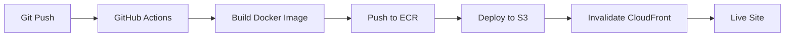

# **SRS - Software Requirements Specification**
## **ATLAS Agro Industrial - Sitio Web Corporativo**

---

### **1. Información General**

| Campo | Valor |
|-------|-------|
| **Proyecto** | ATLAS Agro Industrial - Sitio Web Corporativo |
| **Versión** | 1.0 |
| **Fecha** | 2024 |
| **Tipo** | Single Page Application (SPA) |
| **Arquitectura** | Frontend + Containerización + AWS Cloud |
| **Empresa** | Producción, Procesamiento y Comercialización de Semillas y Granos |
| **Enfoque** | Asesoramiento y Desarrollo de Pequeños Productores |

---

### **2. Requisitos Funcionales**

#### **2.1. Contenido Corporativo**

**2.1.1. Sección Hero (Inicio)**
- **Propuesta de Valor:** "Producción, Procesamiento y Comercialización de Semillas y Granos"
- **Enfoque:** "Asesoramiento y Desarrollo de Pequeños Productores"
- **Call-to-Action:** Botón "Conocer Más" para navegación

**2.1.2. Sobre Nosotros**
- **Misión:** Producir, procesar y comercializar semillas y granos de la más alta calidad
- **Visión:** Ser líderes en producción y comercialización, reconocidos por calidad e innovación
- **Valores Corporativos:**
  - Honestidad
  - Compromiso
  - Generosidad
  - Innovación

**2.1.3. Productos**
- **Chía:** Semilla de chía de alta calidad (orgánica y convencional)
- **Sésamo:** Sésamo premium cultivado con altos estándares (orgánico y convencional)
- **Certificaciones:** Destacar variedades orgánicas y convencionales

**2.1.4. Proceso y Operaciones**
- **Centros de Producción:**
  - Presidente Hayes
  - San Pedro
  - Concepción
  - Cordillera
- **Centro de Acopio y Procesamiento:** San Pedro, Paraguay (instalaciones modernas)

**2.1.5. Calidad y Certificaciones**
- **Análisis:** Pesticidas y herbicidas en laboratorios europeos certificados
- **Proceso:** Uso de ozono en todos los productos
- **Socio Certificador:** CITEC
- **Certificaciones:** ORGÁNICAS, HACCP, ISO
- **Mercados:** Europa y Estados Unidos

**2.1.6. Contacto**
- **Información:** Emails y números de teléfono
- **Formulario:** Campos para nombre, email, teléfono y mensaje

#### **2.2. Funcionalidades Técnicas**

**2.2.1. Internacionalización (i18n)**
- **Idiomas:** Español (ES) y English (EN)
- **Implementación:** react-i18next
- **Almacenamiento:** localStorage para persistencia
- **Detección:** Automática basada en preferencias del navegador

**2.2.2. Sistema de Temas**
- **Temas:** Claro (light) y Oscuro (dark)
- **Persistencia:** localStorage
- **Transición:** Suave entre temas
- **Detección:** Preferencias del sistema operativo

**2.2.3. Responsive Design**
- **Enfoque:** Mobile-first
- **Breakpoints:**
  - XS: 375px (móviles pequeños)
  - SM: 640px (móviles grandes)
  - MD: 768px (tablets)
  - LG: 1024px (laptops)
  - XL: 1280px (laptops grandes)
  - 2XL: 1536px (desktops)
  - 3XL: 1920px (pantallas grandes)

**2.2.4. Progressive Web App (PWA)**
- **Service Worker:** Caching automático
- **Manifest:** Configuración de instalación
- **Offline:** Funcionalidad básica sin conexión
- **Actualizaciones:** Automáticas

---

### **3. Sistema de Diseño**

#### **3.1. Paleta de Colores**

**3.1.1. Colores Semánticos (Tema Claro)**
- **Primary:** `#4A7729` (Verde principal)
- **Accent:** `#002F6C` (Azul principal)
- **Background:** `#F9FAFB` (Gris claro)
- **Surface:** `#FFFFFF` (Blanco)
- **Text Primary:** `#1A1A1A` (Negro suave)
- **Text Secondary:** `#4B5563` (Gris)
- **Border:** `#E5E7EB` (Gris claro)

**3.1.2. Colores Semánticos (Tema Oscuro)**
- **Primary:** `#66BB6A` (Verde claro)
- **Accent:** `#42A5F5` (Azul claro)
- **Background:** `#111827` (Gris oscuro)
- **Surface:** `#1F2937` (Gris medio)
- **Text Primary:** `#F9FAFB` (Gris claro)
- **Text Secondary:** `#9CA3AF` (Gris)
- **Border:** `#374151` (Gris)

#### **3.2. Tipografía**

**3.2.1. Fuentes**
- **Headings:** Montserrat (Pesos: 400, 600, 700)
- **Body Text:** Inter (Pesos: 400, 500, 600)

**3.2.2. Escala Tipográfica Responsive**
- **Hero Mobile:** 2rem (32px)
- **Hero Tablet:** 3rem (48px)
- **Hero Desktop:** 4rem (64px)
- **Section Mobile:** 1.5rem (24px)
- **Section Tablet:** 2rem (32px)
- **Section Desktop:** 2.5rem (40px)

#### **3.3. Componentes UI**

**3.3.1. Botones**
- **Variantes:** Primary, Secondary, Text
- **Tamaños:** Small (sm), Medium (md), Large (lg)
- **Estados:** Hover, Focus, Disabled, Loading

**3.3.2. Tarjetas**
- **Variantes:** Default, Elevated, Outlined
- **Padding:** None, Small, Medium, Large
- **Interactividad:** Hover, Clickable

**3.3.3. Iconos**
- **Librería:** SVG personalizados
- **Tamaños:** Small (16px), Medium (20px), Large (24px)
- **Accesibilidad:** ARIA labels incluidos

#### **3.4. Espaciado y Layout**

**3.4.1. Sistema de Espaciado**
- **Base:** Múltiplos de 4px
- **Mobile Padding:** 1rem (16px)
- **Tablet Padding:** 1.5rem (24px)
- **Desktop Padding:** 2rem (32px)

**3.4.2. Grid System**
- **Columnas:** 12 columnas
- **Breakpoints:** Mobile-first responsive
- **Gaps:** 4px, 6px, 8px según breakpoint

---

### **4. Requisitos de Seguridad**

#### **4.1. Certificados SSL/TLS**
- **Desarrollo Local:** Certificados auto-firmados para testing
- **Producción:** Certificados SSL gestionados por AWS Certificate Manager (ACM)
- **Protocolo:** TLS 1.2+ (mínimo recomendado)
- **Cifrado:** AES-256 para datos en tránsito

#### **4.2. Headers de Seguridad**
- **X-Frame-Options:** SAMEORIGIN
- **X-Content-Type-Options:** nosniff
- **X-XSS-Protection:** 1; mode=block
- **Referrer-Policy:** strict-origin-when-cross-origin
- **Content-Security-Policy:** (configurar según necesidades)

#### **4.3. Configuración HTTPS**
- **Redirección automática:** HTTP → HTTPS
- **HSTS:** Habilitado para forzar HTTPS
- **Perfect Forward Secrecy:** Habilitado

---

### **5. Arquitectura de Despliegue AWS**

#### **5.1. Servicios AWS Requeridos**

| Servicio | Propósito | Configuración |
|----------|-----------|---------------|
| **S3** | Hosting de archivos estáticos | Bucket público con CloudFront |
| **CloudFront** | CDN global + SSL termination | Distribución con ACM |
| **Route 53** | DNS management | Zona hospedada |
| **Certificate Manager** | Gestión de certificados SSL | Certificado wildcard |
| **Lambda@Edge** | Funciones serverless | (Opcional para optimizaciones) |

#### **5.2. Pipeline de Despliegue**



#### **5.3. Configuración de Infraestructura**

**S3 Bucket:**
- **Nombre:** `atlas-agro-website-prod`
- **Región:** `us-east-1` (requerido para CloudFront)
- **Configuración:** Static website hosting
- **Permisos:** Público read-only para archivos estáticos

**CloudFront Distribution:**
- **Origen:** S3 bucket
- **Comportamiento:** Cache optimizado para SPA
- **SSL Certificate:** ACM wildcard `*.atlasagro.com`
- **Custom Error Pages:** 404 → `/index.html` (SPA routing)

**Route 53:**
- **Zona:** `atlasagro.com`
- **A Record:** `www.atlasagro.com` → CloudFront
- **A Record:** `atlasagro.com` → CloudFront

---

### **6. Arquitectura Técnica del Proyecto**

#### **6.1. Stack Tecnológico**

**6.1.1. Frontend Framework**
- **React:** 19.1.0 (Functional Components + Hooks)
- **TypeScript:** 5.5.4 (Tipado estático)
- **Vite:** 6.3.5 (Build tool y dev server)

**6.1.2. UI y Estilos**
- **Tailwind CSS:** 3.4.4 (Utility-first CSS)
- **PostCSS:** 8.4.38 (Procesador CSS)
- **Autoprefixer:** 10.4.19 (Compatibilidad navegadores)

**6.1.3. Gestión de Estado**
- **Redux Toolkit:** 2.2.1 (Estado global)
- **React Redux:** 9.1.2 (Binding React-Redux)
- **TanStack Query:** 5.51.1 (Server state management)

**6.1.4. Enrutamiento y Navegación**
- **React Router DOM:** 7.6.1 (SPA routing)
- **React i18next:** 15.7.3 (Internacionalización)

**6.1.5. Utilidades**
- **Axios:** 1.9.0 (HTTP client)
- **clsx:** 2.1.0 (Conditional classes)
- **tailwind-merge:** 2.2.1 (Merge Tailwind classes)

#### **6.2. Estructura de Directorios**

```
src/
├── components/          # Componentes React
│   ├── ui/             # Componentes base (Button, Card, Icon)
│   ├── Header.tsx      # Header principal
│   ├── Navigation.tsx  # Navegación
│   └── ...
├── contexts/           # Contextos React (Theme, etc.)
├── hooks/              # Custom hooks
├── lib/                # Utilidades y configuración
│   ├── design-system.ts # Sistema de diseño
│   ├── constants.ts    # Constantes
│   ├── i18n.ts         # Configuración i18n
│   └── ...
├── locales/            # Archivos de traducción
│   ├── es.json         # Español
│   └── en.json         # English
├── pages/              # Páginas de la aplicación
├── store/              # Redux store
├── styles/             # Estilos globales
└── main.tsx           # Punto de entrada
```

#### **6.3. Configuración de Build**

**6.3.1. Vite Configuration**
- **Code Splitting:** Por rutas y vendor chunks
- **Compresión:** Gzip y Brotli automático
- **PWA:** Service worker y manifest
- **Bundle Analysis:** Visualizer para optimización

**6.3.2. TypeScript Configuration**
- **Strict Mode:** Habilitado
- **Path Mapping:** Aliases para imports
- **Target:** ES2020
- **JSX:** react-jsx

**6.3.3. Tailwind Configuration**
- **Dark Mode:** Class strategy
- **Custom Colors:** Paleta ATLAS Agro
- **Custom Fonts:** Montserrat + Inter
- **Responsive:** Mobile-first breakpoints

---

### **7. Requisitos de Rendimiento**

#### **7.1. Métricas Objetivo**
- **LCP (Largest Contentful Paint):** < 2.5s
- **FID (First Input Delay):** < 100ms
- **CLS (Cumulative Layout Shift):** < 0.1
- **TTFB (Time to First Byte):** < 600ms

#### **7.2. Optimizaciones Implementadas**
- **Compresión:** Gzip/Brotli automático
- **Cache:** Headers optimizados para assets estáticos
- **CDN:** CloudFront para distribución global
- **Lazy Loading:** Componentes e imágenes
- **Code Splitting:** Por rutas de la SPA

---

### **8. Requisitos de Monitoreo**

#### **8.1. Herramientas de Observabilidad**
- **CloudWatch:** Métricas de CloudFront y S3
- **AWS X-Ray:** (Opcional) Tracing de requests
- **Google Analytics 4:** Métricas de usuario
- **Sentry:** Error tracking en frontend

#### **8.2. Alertas Configuradas**
- **Uptime:** < 99.9% availability
- **Error Rate:** > 1% de requests fallidos
- **Response Time:** > 3s promedio
- **SSL Certificate:** Expiración < 30 días

---

### **9. Requisitos de Backup y Recuperación**

#### **9.1. Estrategia de Backup**
- **Código:** Git repository (GitHub)
- **Assets:** S3 versioning habilitado
- **Configuración:** Infrastructure as Code (Terraform/CDK)

#### **9.2. Plan de Recuperación**
- **RTO (Recovery Time Objective):** < 1 hora
- **RPO (Recovery Point Objective):** < 15 minutos
- **Procedimiento:** Re-deploy automático desde Git

---

### **10. Requisitos de Escalabilidad**

#### **10.1. Capacidad Actual**
- **Usuarios concurrentes:** 1,000
- **Requests/minuto:** 10,000
- **Storage:** < 100MB (SPA assets)

#### **10.2. Escalabilidad Horizontal**
- **CloudFront:** Escalado automático global
- **S3:** Escalado ilimitado
- **Lambda@Edge:** Auto-scaling serverless

---

### **11. Requisitos de Cumplimiento**

#### **11.1. Estándares de Seguridad**
- **OWASP Top 10:** Implementación de controles
- **GDPR:** Consentimiento de cookies (si aplica)
- **WCAG 2.1 AA:** Accesibilidad web

#### **11.2. Auditoría y Logging**
- **CloudTrail:** Logging de cambios en AWS
- **CloudWatch Logs:** Logs de aplicación
- **Retención:** 90 días mínimo

---

### **12. Configuración de Desarrollo**

#### **12.1. Entornos**

| Entorno | Configuración | Acceso |
|---------|---------------|--------|
| **Local** | Docker Compose + Hot Reload | `https://localhost` |
| **Staging** | S3 + CloudFront (subdomain) | `https://staging.atlasagro.com` |
| **Production** | S3 + CloudFront (domain principal) | `https://atlasagro.com` |

#### **12.2. Configuración Docker para Desarrollo**

**Docker Compose Services:**
```yaml
# Desarrollo con hot reload
atlas-dev:
  - Puerto: 5173 (Vite dev server)
  - Puerto: 80 (HTTP)
  - Puerto: 443 (HTTPS)
  - Volúmenes: Montaje de código fuente
  - Hot Reload: Automático sin rebuild

# Producción (testing)
atlas-prod:
  - Puerto: 8080 (HTTP)
  - Puerto: 8443 (HTTPS)
  - Build: Multi-stage optimizado
```

**Comandos de Desarrollo:**
```bash
# Iniciar desarrollo con hot reload
docker-compose up atlas-dev

# Iniciar solo producción
docker-compose --profile production up atlas-prod

# Rebuild de contenedores
docker-compose build --no-cache
```

#### **12.3. Variables de Entorno**

**Desarrollo:**
```bash
NODE_ENV=development
VITE_API_URL=http://localhost:3000
VITE_HMR_PORT=5173
```

**Producción:**
```bash
NODE_ENV=production
VITE_API_URL=https://api.atlasagro.com
```

#### **12.4. Hot Reload y Volúmenes**

**Configuración de Volúmenes:**
- **Código fuente:** Montaje directo (`.:/app`)
- **node_modules:** Volumen anónimo para evitar conflictos
- **Configuración Caddy:** Montaje de `Caddyfile`
- **Hot Reload:** Vite HMR habilitado en puerto 5173

**Beneficios:**
- ✅ **Desarrollo instantáneo:** Cambios reflejados sin rebuild
- ✅ **Debugging nativo:** Breakpoints en código local
- ✅ **Consistencia:** Mismo entorno en todos los desarrolladores
- ✅ **Aislamiento:** Dependencias aisladas en contenedor

---

### **13. Aprobaciones y Firmas**

| Rol | Nombre | Fecha | Firma |
|-----|--------|-------|-------|
| **Product Owner** | [Nombre] | [Fecha] | [Firma] |
| **Tech Lead** | [Nombre] | [Fecha] | [Firma] |
| **Security Lead** | [Nombre] | [Fecha] | [Firma] |

---

**Documento controlado - Versión 1.0 - Última actualización: [Fecha]**
